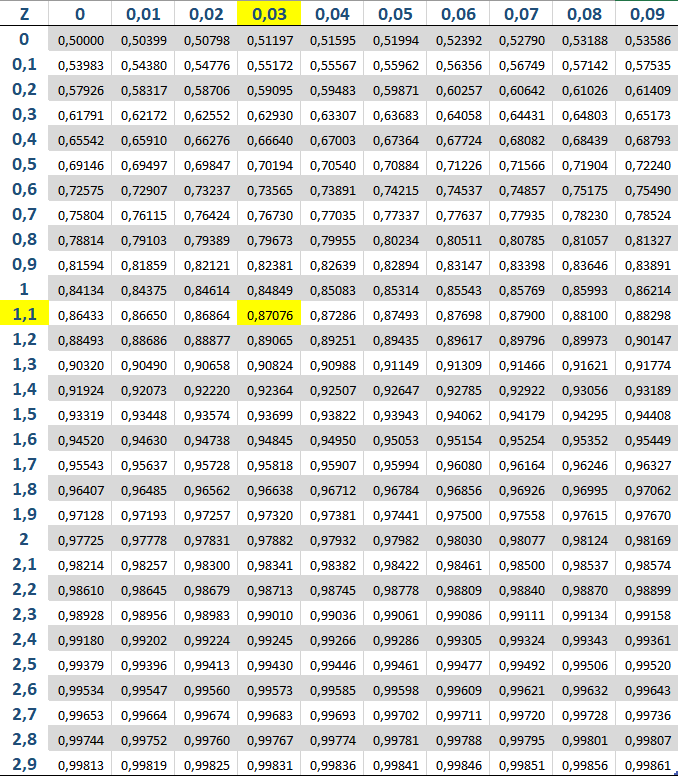

```{r setup, include=FALSE}
knitr::opts_chunk$set(echo = TRUE)
```

# Aviso

**Apenas as cinco primeiras questões da lista serão avaliadas. As cinco últimas são para prática e possuem gabarito, portanto o envio não é necessário.**


<br>

1 - Seja X uma v.a aleatória contínua com a seguinte densidade:


$$f(x)= c(x^2 + 7x)I_{[0,3]}(x)$$
Encontre o valor de $c$ para que esta seja uma densidade válida.


2 - A variável aleatória Y modela a altura em metros de alunos numa sala de aula e possui distribuição normal. Sabe-se que E[Y] = 1.72 E Var[Y] = 0.0144. Use o gráfico da normal para se guiar e calcule.

(a) A probabilidade de um aluno ter mais que 1.90m.

(b) A probabilidade de um aluno ter menos que 1.60m.


(c) A probabilidade de um aluno ter entre 1.63m e 1.72m.


3 - Sabe-se que se $Z\sim N(0,1)$ e $X=Z^2$, a distribuição de X é a Qui-quadrado com 1 grau de liberdade. Sabendo disso, obtenha:

(a) $E[X]$.

(b) $P(X\leq x)$(não é necessário resolver a integral, apenas monte).


4 - Seja X o número de vezes nas quais uma moeda honesta que é jogada 40 vezes dá cara. Determine a probabilidade de que $X = 20$ usando a aproximação normal e então a compare com a solução exata.


5 - Em 10000 jogadas independentes de uma moeda, observou-se que deu cara 5800 vezes. Se a probabilidade de se obter mais que 5800 caras for significativa, é possível supor que a moeda não é honesta. Sabendo disso, é razoável supor que a moeda não seja honesta? Explique.


6 - Seja X uma v.a. contínua tal que:

$$f(x) = \frac{1}{b-a}I_{[a,b]}(x) $$

Encontre $E[X^2]$ para a, b pertencentes aos reais.

7 - O tempo de vida, medido em horas, de uma válvula eletrônica é uma variável aleatória com função de densidade de probabilidade dada por:


$$f(x) = 5e^{-5x}, x > 0$$

Calcule o tempo de vida esperado dessa válvula.


8 - Seja Y uma v.a aleatória com a seguinte função de distribuição acumulada:


$$
F(y)= \begin{cases} 0, \ y < 0 \\ 0.2, \  0\leq y < 2  \\ 0.6, \  2 \leq y < 7 \\ 0.75, \ 7 \leq y < 8  \\ 1, \   y \geq 8  \end{cases}
$$

Encontre $P(2< X \leq 7)$.

9 - Um dado é lançado 1000 vezes. Encontre a probabilidade de se obter 520 faces pares usando a aproximação pela normal. Compare com a aproximação pela Poisson e com o valor exato.


10 - Entre os anos de 2006 e 2009, um grupo de piratas na costa da Somália encontrava navios militares franceses com probabilidade $0.029$, a cada dia. Se eles se encontravam, os piratas atacavam com probabilidade $1$. Qual a probabilidade de terem ocorrido mais de 50 ataques no período? Aproxime pela Poisson. Obs: desconsidere anos bissextos.

# Gabarito

6 -  $\frac{a^2+ab+b^2}{3}$


7 - $\frac{1}{5}$

8 - $0.45$

9 - A aproximação pela normal é mais próxima do valor exato. Lembre que a aproximação pela Poisson também requer "p" pequeno para ser ótima.

Normal: 0.0113383

```{r}
pnorm(520.5, 500, sqrt(250)) - pnorm(519.5, 500, sqrt(250))
```


Poisson: 0.01178669

```{r}
ppois(520, 500)
```

Valor exato:  0.01134098

```{r}
dbinom(520, 1000, 0.5)
```

10 - 0.6227792

# Tabela da normal padrão


Exemplo:$\phi(1.13)$ OU \ $P(Z \leq 1.13)$





