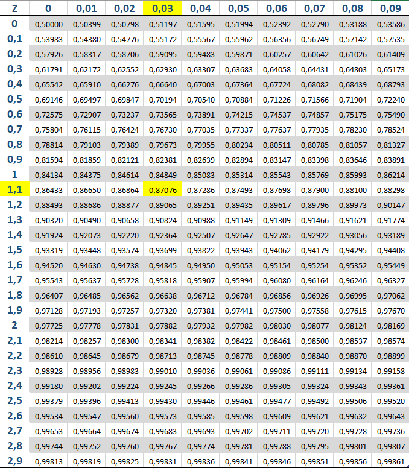
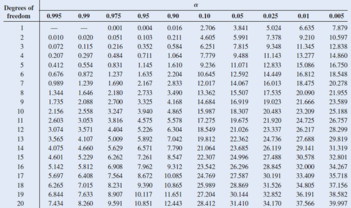

```{r setup, include=FALSE}
knitr::opts_chunk$set(echo = TRUE)
```

# Aviso

**Apenas as cinco primeiras questões da lista serão avaliadas. As cinco últimas são para prática e possuem gabarito, portanto o envio não é necessário.**


<br>

1 - O volume anual de chuvas(em mm) em certa região é normalmente distribuído com $\mu = 40$ e $\sigma = 4$. Qual é a probabilidade de que, a contar deste ano, sejam necessários mais de 10 anos antes que o volume de chuva em um ano supere 50 mm?

2 - Segundo a _Cosmos Magazine_, uma revista de divulgação científica, estima-se que o planeta Terra é atingido por 6100 meteoritos por ano, sejam eles pequenos ou grandes. Sabendo de tal fato interessante, um estudante de astronomia quer obter as seguintes informações:

(a) Quantas quedas de meteoritos são esperadas entre março e abril.

(b) Suponha que um meteorito caiu nesse instante. Deseja-se obter a probabilidade do próximo cair em até 30 minutos.

(c) A probabilidade do meteorito de número 500 cair após o dia 31 de janeiro.

Obtenha as informações desejadas pelo estudante considerando um ano que não é bissexto.


3 - A distribuição Qui-quadrado é amplamente utilizada em inferência estatística e pode ser interpretada de mais de uma forma. Considere X uma variável aleatória tal que $X \sim \chi^2(12)$. Usando a tabela da distribuição Qui-quadrado, obtenha um valor para $k$, onde $P(X \leq k) = 0.95$.

4 - Em um semestre atípico, as notas de uma turma de Cálculo 3 são dadas por uma variável aleatória Y. Sabendo que Y é Qui-quadrado com $4$ graus de liberdade, obtenha a probabilidade da nota de um aluno ser maior do que 7.

Dica: $X \sim Ga(\frac{n}{2}, \frac{1}{2})$ e $X \sim \chi^2(n)$ são equivalentes.


5 - Joel é um rapaz apaixonado por música e quer comprar uma caixa de som nova, porém ele está preocupado com o tempo de vida útil do aparelho, já que ele preza muito por qualidade, mas não está com muito dinheiro para gastar no produto. O número de anos que uma caixa de som funciona é exponencialmente distribuído com $\lambda = \frac{1}{8}$. Se Joel comprar uma caixa de som usada, qual é a probabilidade de que ela funcione por mais 16 anos?

6 - Mostre que se $X \sim Ga(1, \lambda)$, então $X \sim Exp(\lambda)$.

7 - Se X é uma variável aleatória exponencial com parâmetro $\lambda = 1$, calcule a função densidade de probabilidade da variável aleatória Y definida como $Y = log X$.

8 - Não é comum numa sala de aula a maioria dos alunos ser composta por canhotos. De toda a população, apenas 12% são canhotos. Obtenha um valor aproximado para a probabilidade de que existam pelo menos 20 canhotos em uma escola de 200 alunos.


9 - A moda de uma variável aleatória contínua com densidade $f$ é o valor de $x$ no qual $f(x)$ atinge seu máximo. Calcule a moda de X quando X é:

(a) Normal com parâmetros $\mu$, $\sigma^2$.

(b) Exponencial com  taxa $\lambda$.

(c) Gamma com parâmetros $1$, $\lambda$.


10 - Seja X uma variável aleatória normal com média 12 e variância 4. Determine o valor de c tal que $P(X > c) = 0.10$.


# Gabarito


7 - $f_Y(y) = e^y e^{-e^{y}}$

8 - 0.8362562

```{r}
1  - pnorm(19.5, 200*0.12, sqrt(200*0.12*(1 - 0.12)))
```


9 -

(a) $\mu$

(b) 0

(c) 0

10 - 14.56


\newpage 

# Tabela da normal padrão


Exemplo:$\phi(1.13)$ OU \ $P(Z \leq 1.13)$




\newpage

# Tabela Qui-quadrado

Degrees of Freedom = Graus de liberdade

$\alpha =  P (X > x)$


